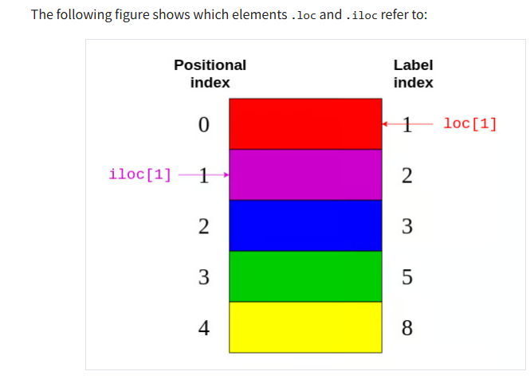

# type

## 概览

理解Python数据科学生态系统中的各种数据类型和结构确实可能会令人困惑。下面我整理了一个全面的表格，帮助您区分这些容易混淆的类型：

| 类别 | 类型名称 | 所属库 | 描述 | 示例 | 常见用途 |
|------|----------|--------|------|------|----------|
| **基础数据结构** | list | Python内置 | 有序可变序列 | `[1, 2, 3]` | 存储有序元素集合 |
| | tuple | Python内置 | 有序不可变序列 | `(1, 2, 3)` | 存储不可变数据 |
| | dict | Python内置 | 键值对映射 | `{"a": 1, "b": 2}` | 快速查找、映射关系 |
| | set | Python内置 | 无序不重复集合 | `{1, 2, 3}` | 去重、集合运算 |
| **NumPy类型** | ndarray | NumPy | 高效同质多维数组 | `np.array([1, 2, 3])` | 数值计算、向量化运算 |
| | matrix | NumPy | 特殊的2D数组(已弃用) | `np.matrix([[1,2],[3,4]])` | 矩阵运算(不推荐使用) |
| **Pandas类型** | Series | Pandas | 带索引的一维数组 | `pd.Series([1,2,3], index=['a','b','c'])` | 时间序列、向量化带标签计算 |
| | DataFrame | Pandas | 表格数据结构 | `pd.DataFrame({'A':[1,2], 'B':[3,4]})` | 数据分析、处理表格数据 |
| | Index | Pandas | 索引对象 | `pd.Index(['a', 'b', 'c'])` | 定义DataFrame/Series的行/列索引 |
| | MultiIndex | Pandas | 多级索引 | `pd.MultiIndex.from_tuples([('a',1),('a',2)])` | 处理多维数据 |
| | Panel (弃用) | Pandas | 3D数据结构 | `pd.Panel(data)` | 3D数据(现用DataFrame替代) |
| **元素数据类型(dtype)** | int8/16/32/64 | NumPy/Pandas | 不同精度整数 | `np.int64(42)` | 整数运算 |
| | float16/32/64 | NumPy/Pandas | 不同精度浮点数 | `np.float64(3.14)` | 小数运算 |
| | bool | NumPy/Pandas | 布尔值 | `np.bool_(True)` | 条件判断 |
| | object | NumPy/Pandas | Python对象引用 | `np.array(['a', 'b'], dtype='object')` | 存储字符串、混合类型 |
| | string | Pandas | 字符串数组 | `pd.Series(['a', 'b'], dtype='string')` | 优化的字符串操作 |
| | category | Pandas | 分类数据 | `pd.Series(['a', 'b'], dtype='category')` | 节省内存的分类变量 |
| | datetime64 | NumPy/Pandas | 日期时间 | `np.datetime64('2023-01-01')` | 时间戳、日期运算 |
| | timedelta64 | NumPy/Pandas | 时间间隔 | `np.timedelta64(1, 'D')` | 时间差计算 |
| **特殊类型** | sparse | Pandas | 稀疏数据结构 | `pd.Series([0, 0, 1, 0], dtype='Sparse')` | 高效存储含大量0/NA的数据 |
| | interval | Pandas | 区间数据 | `pd.Interval(0, 1)` | 范围值表示 |
| | period | Pandas | 时间周期 | `pd.Period('2023-01', freq='M')` | 固定时间跨度表示 |
| | array | Pandas | 扩展数组 | `pd.array([1, 2, 3])` | 自定义数组行为 |

**混淆易发区域**：
1. `list` 和 `Series` - 都是一维数据，但Series带标签且有更多数据处理功能
2. `dict` 和 `DataFrame` - 都是键值结构，但DataFrame是二维的、支持向量化操作
3. `object dtype` 和 Python对象 - dtype='object'是指数组中存储的是Python对象的引用
4. `ndarray` 和 `Series` - Series本质上是由ndarray加上索引构成
5. 各种数值dtypes(`int32`, `float64`等) - 它们影响内存使用和计算精度，但不改变数据结构类型

希望这个表格能帮助您更好地区分这些数据类型和结构！

## 常见的pandas/NumPy数据类型：

在pandas和NumPy中，`dtype='object'`是数据类型的一种，但还有许多其他数据类型可用。`dtype`（数据类型）决定了如何在内存中存储和处理数据。

### 数值类型

- **int8, int16, int32, int64** - 不同精度的整数
- **uint8, uint16, uint32, uint64** - 无符号整数
- **float16, float32, float64** - 不同精度的浮点数
- **complex64, complex128** - 复数

### 布尔类型

- **bool** - 真/假值

### 字符串类型

- **object** - 通常用于字符串或混合数据类型
- **string** (pandas) - 专门针对字符串的优化类型

### 时间类型

- **datetime64** - 日期和时间
- **timedelta64** - 时间间隔
- **period** - 时间周期

### 分类类型

- **category** - 用于有限、固定集合的值（如性别、国家等）

### 其他特殊类型

- **sparse** - 用于稀疏数据（大多数值为0或NA）
- **interval** - 表示区间

## `dtype='object'`的特点

- 最通用的类型，可以存储任何Python对象
- 通常用于存储字符串
- 也用于存储混合类型的数据
- 操作效率较低，因为每个元素都是指向Python对象的指针
- 占用内存较多

当你发现DataFrame列的类型是`object`时，通常应考虑是否可以转换为更具体、更高效的类型，比如将字符串转为`category`，或将数值字符串转为数值类型。

## pd.series 和 pd.DataFrame 的数据类型

- `pd.Series`的数据类型可以通过`dtype`属性查看
- `pd.DataFrame`的数据类型可以通过`dtypes`属性查看

```python
import pandas as pd

s = pd.Series([1, 2, 3])
print(s.dtype)  # int64

df = pd.DataFrame({'A': [1, 2, 3], 'B': ['a', 'b', 'c']})
print(df.dtypes)
```

使用`pd.Series({"Amsterdam": 5, "Tokyo": 8})`创建Series的方式是使用了字典作为输入数据，这与直接使用字典有几个关键区别：

1. **索引和值分离**：
   - Series将字典的键作为索引(index)，值作为数据(values)
   - 可以通过`.index`和`.values`分别访问

2. **NumPy/pandas功能**：
   - Series支持矢量化操作，可以一次对所有元素执行数学运算
   - 内建统计方法如`.mean()`, `.sum()`, `.std()`等
   - 支持缺失值处理(NaN)

3. **对齐功能**：
   - 基于索引的自动对齐，在Series间运算时特别有用
   - 例如：两个不同城市集的Series相加时，会按城市名对齐

4. **索引功能**：
   - 支持基于标签的复杂索引，如`.loc`和`.iloc`
   - 支持多层次索引(MultiIndex)

5. **数据分析集成**：
   - 与pandas其他组件(如DataFrame)无缝集成
   - 可以轻松转换为其他数据结构

这种定义方式特别适合当你想要为数据添加标签，并进行基于标签的操作时使用。如果只需要简单的键值对存储而不需要数据分析功能，普通字典可能更合适。

## 例子

You can also refer to the 2 dimensions of a DataFrame as axes:

```python
           revenue  employee_count
Amsterdam     4200             5.0
Tokyo         6500             8.0
Toronto       8000             NaN

>>> city_data.axes
[Index(['Amsterdam', 'Tokyo', 'Toronto'], dtype='object'),
 Index(['revenue', 'employee_count'], dtype='object')]
>>> city_data.axes[0] # row index 每行的索引
 Index(['Amsterdam', 'Tokyo', 'Toronto'], dtype='object')
>>> city_data.axes[1] # column index 每列的索引
 Index(['revenue', 'employee_count'], dtype='object')
```

The axis marked with 0 is the row index, and the axis marked with 1 is the column index. This terminology is important to know because you’ll encounter several DataFrame methods that accept an axis parameter.

A DataFrame is also a dictionary-like data structure, so it also supports .keys() and the in keyword. However, for a DataFrame these don’t relate to the index, but to the columns:

```python
>>> city_data.keys() # 列名 axes[1]
Index(['revenue', 'employee_count'], dtype='object')
>>> "Amsterdam" in city_data
False
>>> "revenue" in city_data
True
```

.loc refers to the label index.
.iloc refers to the positional index.

You can use .iloc on a Series similar to using [] on a list.
You can use .loc on a Series similar to using [] on a dictionary.

```python
>>> city_data.loc["Amsterdam"] # 通过索引获取行数据
revenue            4200.0
employee_count        5.0
Name: Amsterdam, dtype: float64
>>> city_data.iloc[0] # 通过位置获取行数据
revenue            4200.0
employee_count        5.0
Name: Amsterdam, dtype: float64
```