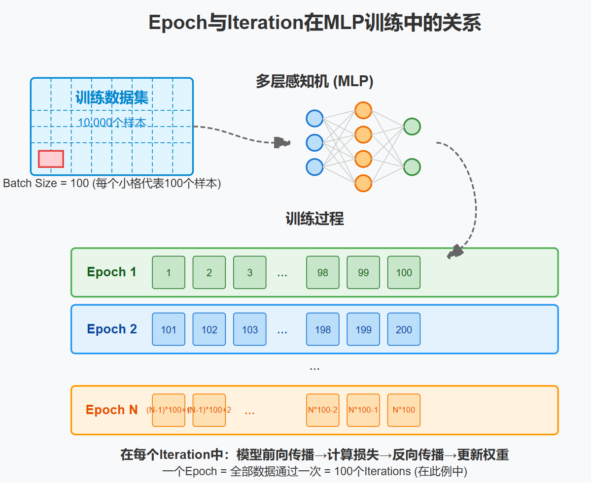

# Epoch 与 Iteration 的区别



在深度学习模型训练中，epoch 和 iteration 是两个重要但容易混淆的概念。下面来解释它们的区别：

## Epoch (轮次)

* **定义** ：一个 epoch 是指将整个训练数据集完整地通过神经网络一次。
* **特点** ：
* 每个 epoch 意味着模型"看到"了全部训练样本一次
* epoch 的数量是模型训练的主要超参数之一
* 通常训练需要多个 epoch 才能达到好的性能

## Iteration (迭代)

* **定义** ：一个 iteration 是指一批数据(mini-batch)通过网络完成一次前向传播和一次反向传播的过程。
* **特点** ：
* 每个 iteration 只处理一个批次的数据
* 当数据集很大时，一个 epoch 包含多个 iteration
* 每个 iteration 后都会更新一次模型参数

## 数学关系

它们之间的关系可以通过以下公式表示：

```
iterations_per_epoch = 训练样本总数 / batch_size
total_iterations = iterations_per_epoch * epochs
```

## 举例说明

假设有一个包含 50,000 个样本的训练数据集，batch_size 设为 100：

* 完成一个 epoch 需要 50,000 ÷ 100 = 500 个 iteration
* 如果训练 10 个 epoch，总共需要 500 × 10 = 5,000 个 iteration
* 每个 iteration 处理 100 个样本
* 每个 epoch 处理 50,000 个样本

## 在代码中的表示

```python
# PyTorch 中的示例
for epoch in range(num_epochs):  # 外层循环是 epochs
    for i, (inputs, labels) in enumerate(train_loader):  # 内层循环是 iterations
        # 前向传播
        outputs = model(inputs)
        loss = criterion(outputs, labels)
    
        # 反向传播和优化
        optimizer.zero_grad()
        loss.backward()
        optimizer.step()
```

## 实际应用中的选择

* **epoch 数量** ：通常从几十到几百不等，取决于数据集大小和模型复杂度
* **batch size** ：常见值有 16、32、64、128、256 等，受限于 GPU 内存和训练稳定性

理解 epoch 和 iteration 的区别有助于更好地监控训练过程、调整学习率策略以及实现早停等技术。
