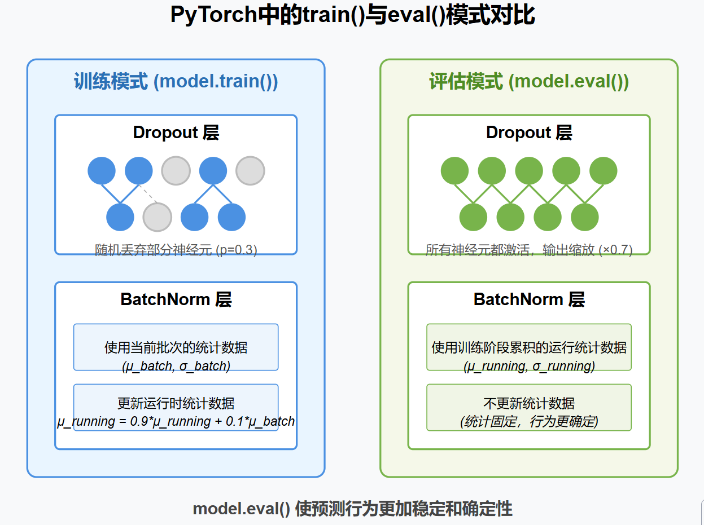

对于  **Dropout 层** ：

* 训练模式下，部分神经元会被随机"丢弃"（图中灰色神经元），以防止过拟合
* 评估模式下，所有神经元都保持激活状态，但输出会被适当缩放（通常乘以保留率，如0.7），确保输出幅度一致

对于  **BatchNorm 层** ：

* 训练模式下，每批数据都用自身的均值和方差进行归一化，并且会不断更新模型存储的运行统计数据
* 评估模式下，使用训练过程中积累的全局统计数据进行归一化，不再更新这些统计值
