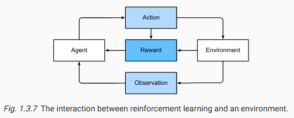

# Reinforcement Learning

强化学习对代理在一系列时间步骤上与环境交互的问题进行了非常概括的陈述。

在每个时间步骤，代理都会从环境中接收一些*观察结果，并且必须选择一个动作，
随后通过某种机制（有时称为* *执行器* ）将该动作传回环境 ，
每次循环之后，代理都会从环境中获得奖励。该过程[如图 1.3.7](https://d2l.ai/chapter_introduction/index.html#fig-rl-environment)所示 。
然后，代理会接收后续观察结果，并选择后续动作，依此类推。

强化学习代理的行为受*策略*支配。简而言之， *策略*只是一个将环境观察结果映射到动作的函数。

强化学习的目标是制定好的策略。

举例： 对于 10 月 11 日升职的员工来说也是如此。这次升职可能反映了过去一年中一系列精心挑选的行动。未来升职需要弄清楚哪些行动导致了之前的升职。

一般强化学习问题具有非常普遍的设定。动作会影响后续观察。**只有当奖励与所选动作相对应时，才会观察到奖励。**环境可以被完全或部分地观察到。一次性考虑所有这些复杂性可能要求太高。此外，并非每个实际问题都表现出所有这些复杂性。因此，研究人员研究了许多强化学习问题的特殊情况。

当环境被完全观察到时，我们将强化学习问题称为马尔可夫决策过程Markov decision process。当状态不依赖于之前的动作时，我们将其称为上下文老虎机contextual bandit problem问题。当没有状态，只有一组可用的动作和最初未知的奖励时，我们就会得到经典的多臂老虎机multi-armed bandit problem问题。

## Key Principles

1. The alternation of linear and nonlinear processing units, often referred to as **layers**.
线性和非线性处理单元的交替，通常称为层。

2. The use of the chain rule (also known as backpropagation) for adjusting parameters in the entire network at once.
使用链式法则（也称为反向传播）一次性调整整个网络的参数。